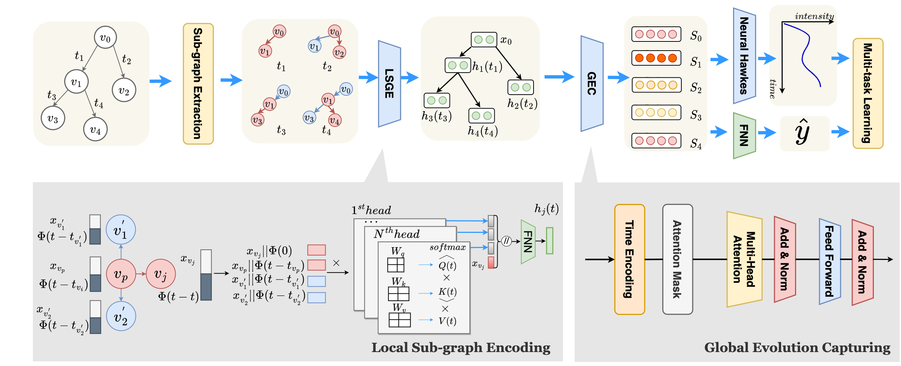

# SEAGEN
Self-Exciting-Aware Graph Evolution Network. 

Reposiory for Paper ["Fake News Detection Through Temporally Evolving User Interactions"](https://link.springer.com/chapter/10.1007/978-3-031-33383-5_11) in PAKDD-2023.

## Paper Abstract

Detecting fake news on social media is an increasingly important problem, because of the rapid dissemination and detrimental impact of fake news. Graph-based methods that encode news propagation paths into tree structures have been shown to be effective. Existing studies based on such methods represent the propagation of news through static graphs or coarse-grained graph snapshots. They do not capture the full dynamics of graph evolution and hence the temporal news propagation patterns. To address this issue and model dynamic news propagation at a finer-grained level, we propose a temporal graph-based model. We join this model with a neural Hawkes process model to exploit the distinctive self-exciting patterns of true news and fake news on social media. This creates a highly effective fake news detection model that we named SEAGEN. Experimental results on real datasets show that SEAGEN achieves an accuracy of fake news detection of over 93% with an advantage of over 2.5% compared to other state-of-the-art models.



## Dataset

The dataset used in the paper are Twitter and FakeNewsNet. Twitter dataset is the fusion of publicly released dataset Twitter15 and Twitter16 by (Ma et al. 2016). The original data from Twitter15 and Twitter16 contains 4 labels (true-rumour, false-rumour, non-rumour and unverified). Only true-rumour and false-rumour data samples are collected and form the Twitter dataset, in which true-rumour is defined as true news, and false-rumour is defined as false/fake news. 

FakeNewsNet dataset is released by (Shu et al. 2020) with [link](https://github.com/KaiDMML/FakeNewsNet). Due the availability issue of the FakeNewsNet dataset, only a subset of it is used in the experiment. 

Both the Twitter and FakeNewsNet datasets are proprocessed to fit the model in our paper. The preprocessed FakeNewsNet can be downloaded from [GoogleDrive Link](https://drive.google.com/file/d/1DwqMoI0owAYxpCm0jfJL_dlE5y2ignv4/view?usp=share_link). 

## Requirements

The requirements of the project include packages: 
```
networkx
numpy
pytorch
scikit-learn
```

There is no specific version requirements. 

## To Reproduce the Experiment

For example with the FakeNewsNet dataset, download the FakeNewsNet dataset (link is provided above in Dataset), unzip it to the project path, and name the dataset folder as 'fakenewsnet'. Then run command: 

   ```sh
    python my_main.py
   ```
## Reference 

[1] Jing Ma, Wei Gao, Kam-Fai Wong. Detect Rumors in Microblog Posts Using Propagation Structure via Kernel Learning. ACL 2017.

[2] K. Shu, D. Mahudeswaran, S. Wang, D. Lee, and H. Liu, “Fakenewsnet: A data repository with news content, social context, and spatiotemporal information for studying fake news on social media,” Big data, vol. 8, no. 3, pp. 171–188, 2020.

## Citation
If you find this code useful for your research, please cite our paper: 

```
@inproceedings{gong2023fake,
  title={Fake News Detection Through Temporally Evolving User Interactions},
  author={Gong, Shuzhi and Sinnott, Richard O and Qi, Jianzhong and Paris, Cecile},
  booktitle={Pacific-Asia Conference on Knowledge Discovery and Data Mining},
  pages={137--148},
  year={2023},
  organization={Springer}
}
```
